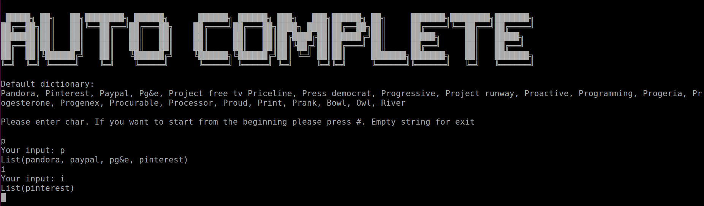

# Autocomplete

This project is a simulation of the **Google auto-complete** feature. The program suggests up to 4 words based on the letters type(not case sensitve), except that the resuts are not ranked but naturally ordered.

## Getting Started
You can run the program with the sbt or in your favorite IDE. The main class is `com.satybald.Main`.

The program expects a user to enter his letters from StdIn and then press Enter.



The project runs until users submit non empty line.

## Optional questions
>>> What would you change if the list of keywords was large (several millions)?

I would compress Trie, and merge the common branches which should reduce memory foot print and gain performance speedup.

>>> What would you change if the requirements were to match any portion of the keywords?

I would use [Aho–Corasick algorithm](https://en.wikipedia.org/wiki/Aho%E2%80%93Corasick_algorithm) which is Trie + regular automata to build a tree and do a partial match on the input keywords.

## Installing
The project has minimalistic dependencies. To run the program it requires installed sbt and scala-test.

After installation the program can be run with:
```
sbt runMain com.satybald.Main
```

## Running the tests
```
sbt test
```

## License
This project is licensed under the MIT License - see the [LICENSE.md](LICENSE.md) file for details